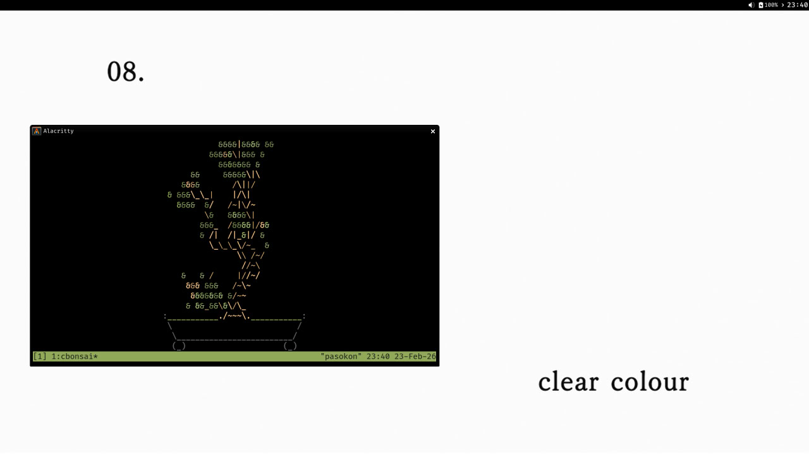

# Gohan - It's just dotfiles.

- GTK theme: [Adwaita Dark Amoled](https://www.gnome-look.org/p/1553851)
- Icon theme: [Papirus Dark](https://www.gnome-look.org/p/1166289)
- Font: Fira Code

## Setup
Configurations files can be symlinked in place by using GNU `stow`.  There are
a few (currently one) exceptions: - the `crontab` file for which it seems
better to `crontab [-u user] cron/crontab`.

## Untracked files
Put your bookmarks/snippets in `scripts/snippets.txt` and your newsboat
feeds in `newsboat/.newsboat/urls`.
